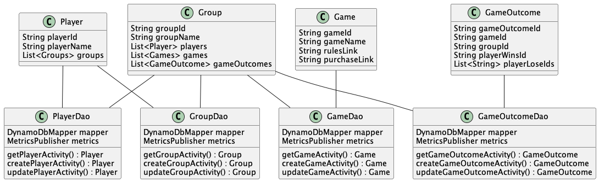

# GameBoard Design Document

## 1. Problem Statement
I want to let a user be able to keep track of their wins and losses when playing board games with friends!

The user can create groups with other users that they play games with.

Within those groups, users can update and keep track of every time someone wins at a game.

Users can add or remove games from the list of games that they play.

Finally users can add or remove players from the group.


## 2. Top Questions to Resolve in Review

1. How can I reduce the amount of api requests being made?  Caching?
2. Can I organize the data in my tables more efficiently?  If so, how?
3. Is there a better design for my GSI?  How can I utitilize GSI's more efficiently?


## 3. Use Cases

U1.  As a GameBoard user, I want to be able to create a new group with other users.

U2.  As a GameBoard user, I want to be able to join groups with other users.

U3.  As a GameBoard user, I want to be able to keep track of how many times I win or lose a game.

U4.  As a GameBoard user, I want to be able to choose games from a default list of all the games my group plays and view information about each game.

U5.  As a GameBoard user, I want to be able to see the wins and loses of the all users in my group, with the ability to sort by game.

U6.  As a GameBoard user, I want to be able to add a new game, that is not on the default list, to my group's list of games.

U7.  As a GameBoard user, I want to be able to remove games from my group's list of games.

U8.  As a GameBoard user, I want to be able to compare my win/loss ratio for the same game across multiple groups.

U9.  As a GameBoard user, I want to be able to select which game is my group's favorite game and have that publicly displayed.

## 4. Project Scope


### 4.1. In Scope

* Creating and retrieving groups of users.
* View an individual user's win/loss ratio for a specific game within an individual group.
* Add and remove games from a list specific to each group.
* View other users win/loss ratio for a specific game within a group.
* View information about each individual game.

### 4.2. Out of Scope
* Comparing a user's win/loss ratio for specific games across multiple groups.
* Allow users to add their new games to the database.

# 5. Proposed Architecture Overview
This initial iteration will provide the minimum lovable product (MLP) including the ability to form groups with other users and keep track of individual users wins and losses within the group.

I will be using API Gateway and Lambda to create 14 API endpoints.

I will be using tables in DynamoDB to store the player, group, game, and gameOutcome data.




# 6. API

## 6.1. Public models


```
// PlayerModel
String playerId
String playerName
Set<String> groups

// GroupModel
String groupId
String groupName
String favoriteGameId
Set<String> gameIds
Set<String> gameOutcomeIds
Set<String> playerIds

// GameModel
String gameId
String gameName
String rulesLink
String purchaseLink

// GameOutcomeModel
String gameOutcomeId
String groupId
String gameId
String playerWinId
Set<String> playerLoseIds

```


## 6.1. Get Player Endpoint
* Accepts `GET` requests to `/players/:playerId`
* Accepts the `"playerId":"examplePlayerId"` and returns the corresponding `player`.
    * If the given player is not found, will throw a
      `PlayerNotFoundException`

## 6.2. Update Player Endpoint
* Accepts `PUT` requests to `/players/:playerId`
* Accepts a `"playerId":"examplePlayerId"` and the data `{"playerName":"Example Name", "groups":"example groupIds"}` to update a Player.  It then returns the update `player`.
    * if the playerId is not found, will throw a `PlayerNotFoundException`

## 6.3. Create Player Endpoint
* Accepts a `POST` request to `/players/`
* Accepts the data `{"playerName":"Example Name", "groups":"example groupIds"}` to create a new Player with a playerName, groups, and playerId generated by GameBoard.  The new `player` is then returned.
    * if the player is invalid return `PlayerNotValidException`

## 6.4. Remove Player Endpoint
* Accepts `DELETE` requests to `/players/:playerId`
* Accepts a `"playerId":"examplePlayerId"` and deletes the corresponding player. Returns `"playerId successfully deleted"`.
    * if the playerId is not found return `PlayerNotFoundException`

## 6.5. Get Group Endpoint
* Accepts `GET` requests to `/groups/:groupId`
* Accepts a `"groupId":"exampleGroupId"` and returns the corresponding `group`.
    * if the groupId is not found return `GroupNotFoundException`

## 6.6. Create Group Endpoint
* Accpts a `POST` request to `/groups/`
* Accepts the data `{"playerName":"Example Name", "groups":"example groupIds"}` to create a new Group with a groupName, players, games, and isShown.  Returns the new `group`.
    * if group could not be created return `GroupNotValidException`

## 6.7. Update Group Endpoint
* Accepts a `PUT` request to `/groups/:groupId`
* Accepts a `"groupId":"exampleGroupId"` to update a group.  Returns the updated `group`.
    * if the groupId is not found return `GroupNotFoundException`

## 6.8. Get Game Endpoint
* Accepts a `GET` request to `/games/:gameId`
* Accepts a `"gameId":"exampleGameId"` and returns the corresponding `game`.
    * if the `gameId` is not found return `GameNotFoundException`

## 6.9. Create Game Endpoint
* Accepts a `POST` request to `/games/`
* Accepts data `{"gameName":"Example Game", "gameRules":"ExampleLinkToRules", "purchaseLink":"ExampleAmazonLink"}` to create a new game with a provided gameName, gameRules, purchaseLink.  Returns the new `game`.
    * if the game is not created return `GameNotValidException`

## 6.10. Update Game Endpoint
* Accepts a `PUT` request to `/game/:gameId`
* Accepts a `"gameId":"exampleGameId"`  to update a game. Returns the updated `game`.
    * if the `gameId` is not found return `GameNotFoundException`

## 6.11. Get GameOutcome Endpoint
* Accepts a `GET` request to `/gameOutcome/:gameOutcomeId`
* Accepts a `"gameOutcomeId":"exampleGameOutcomeId"` to return a `gameOutcome`.
    * if the gameOutcomeId is not found return `GameOutcomeNotFoundException`

## 6.12. Update GameOutCome Endpoint
* Accepts a `PUT` request to `/gameOutcome/:gameOutcomeId`
* Accepts a `"gameOutcomeId":"exampleGameOutcomeId"` to update a gameOutcomeId. Returns the updated `gameOutcome`.
    * if the `gameOutcomeId is not found return `GameOutcomeNotFoundException`

## 6.13. Create GameOutcome Endpoint
* Accepts a `POST` request to `/gameOutcome/`
* Accepts a `{"gameId":"Example game", "groupId":"example groupId", "playerWinId":"Example Player ID", "playersLosers":"example playerIds"}` to create a gameOutcome. Returns the new `gameOutcome`.
    * if the gameOutcome is invalid return `GameOutcomeNotValidException`

## 6.14. Remove GameOutcome Endpoint
* Accepts a `DELETE` request to `/gameOutcome/:gameOutcomeId`
* Accepts a `"gameOutcomeId":"exampleGameOutcomeId"` to remove a game. Returns `"gameOutcomeID"` was successfully deleted.
    * if the gameOutcomeId is not found return `GameOutcomeNotFoundException`


# 7. Tables

## 7.1 Players
```
playerId // string, partitionKey
playerName // string
groupIds // set string

```

## 7.2 Groups
```
groupId // string, partitionKey
groupName // string
favoriteGameId // string
playerIds // set string
gameIds // set string
gameOutcomeIds // set string
```

## 7.3 Games
```
gameId // number, partitionKey
gameName // string
gameRules // string
purchaseLink // string
```

## 7.4 GameOutcomes
```
gameOutcomeId // string, partitionKey
groupId // string, sortKey
gameId // string
playerWin // set string
playersLosers // set string
```

## 7.4 GameOutcomes outcomesByGame GSI
```
gameOutcomeId // string, partitionKey
groupId // string
gameId // string, sortKey
playerWin // set string
playersLosers // set string
```


# 8. Pages

See figma link for a flow board.
https://www.figma.com/file/PYOTTLM2QGxdPn4sze4gON/GameBoard-rough-draft-flowboard?node-id=0%3A1&t=2A8Sp3rgwfxVbqPd-0